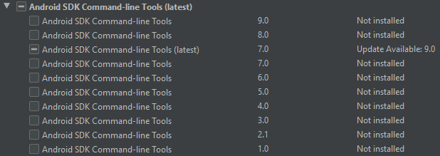

# Configuração do ambiente de desenvolvimento para PICO Neo 3 Pro

### Requisitos
- Unreal Engine 4.27.2
- Android Studio
- PICO Neo 3 Pro (Versão PUI 4.8.17)

### Intruções
1. Instalar Android Studio versão 4.0 no disco em que está instalado a Unreal Engine (O instalador está disponível no Teams no grupo XR Center Edu no diretório OculusUE na aba desenvolvimento)
2. Na interface do Android Studio acesse `Configure -> SDK Manager`

3. Na aba SDK Tools acione a caixa `Show Package Details`

4. Procure pela seção `Android SDK Command-line Tools`, desmarque a opção se houver instalada e substitua pela versão 8.0

5. Acesse a pasta do seu usuário `C:\Users\$User\AppData\Local\Android\Sdk\cmdline-tools` e substitua a pasta dentro dele pelo nome latest

4. Substituir SetupAndroid.bat pelo arquivo do repositório em "C:\Program Files\Epic Games\UE_4.27\Engine\Extras\Android" e executar script
5. Alterar versões do SDK no Android Studio com a versão especificada do Oculus (Provavelmente é a 29)

### Criando projeto para VR no PICO
1. Criar novo projeto com as seguintes configurações:
- Blank
- C++ ou Blueprints
- Scalable 3D or 2D
- Mobile/Tablet
- No Starter Content
2. Baixar SDK do PICO disponível no mesmo repositório do Teams e adicionar os plugins em uma pasta "Plugins" no root do projeto criado.
3. Na Unreal, acesse `Project Settings -> Android` e altere `Minimum SDK Version` para 24 e `Target SDK Version` para 28
4. Desabilite o plugin Oculus XR do Quest e verifique se os Plugins do PICO foram habilitados.
5. Basta iniciar o packaging direcionado a Android ASTC e utilizar o instalador gerado na pasta do cook com o Oculos conectado por USB. Para testar conexão com óculos é possível usar o comando `adb devices`.

### Ferramenta de preview
- Baixar preview do site do PICO
- Com o Neo 3 conectado ao computador utilize o comando no cmd: "adb install ..." e arraste o apk do preview para o cmd
- Instale o preview no windows e execute, ainda com o Neo 3 conectado ao óculos abra o aplicativo e reabra a Unreal